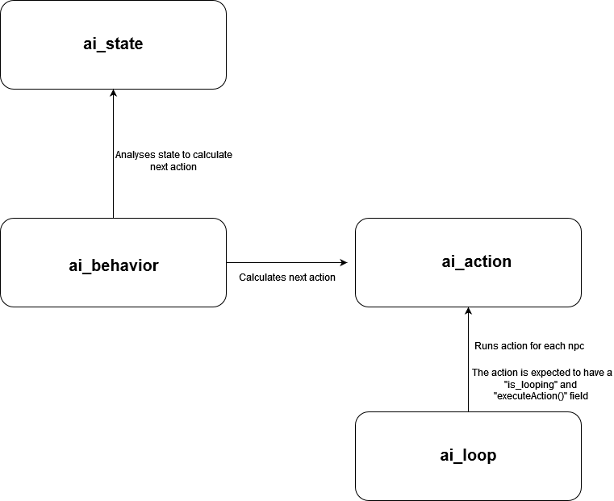

# Lightweight Monster AI for the Gothic 2 Multiplayer (GMP)

## Short feature summary:
- Monster warn nearby player and attack them
- Different attacking strategies
- Pathfinding (Using Gothic 2 waynet system)
- Monster Respawn

## Getting started

The scripts can be used immediately to start a server. The only thing necessary is a clean Gothic 2 installation and the GMP Server + Client. (No .mod required). The scripts were tested using GMP version 1.5.3. The entry point is /gamemodes/bootstrap.lua. The ai scripts are initialized using the ai_init.lua module.

## Mental model

The core idea of how the AI works is really simple. It consists of a loop that is triggered every 50 milliseconds, where it runs through every npc, analyses it's state and calculates the next action to execute for that npc.

There are 4 parts that are involved in that process:
 
 

 
 
### **/ai_scripts/ai_state.lua:**

This file contains all npc related states like their position, list of nearby enemies etc.

### **/ai_scripts/ai_action.lua:**

This file contains several action's an npc can execute. An action is basically a void function that lets an NPC do things. Like playing an animation, hitting another player etc. However since an action sometimes needs some specific state to execute more complex actions it is implemented as a table that is expected to have 2 fields.
a) A field "is_looping" that describes wether the action should continue to run
b) A field "executeAction()" which is the void function that actually runs the action

### **behavors for example "ai_scripts/behaviors/ai_default_monster_behavior.lua":**

A behavor analyses the NPC state and calculates the next action for an npc to run. For example it analyses wether any enemies are nearby, if yes it returns a warn action as next action to execute.

### **/ai_scripts/ai_loop.lua**

The ai loop runs every 50 milliseconds, it runs through every npc, looks if an npc has a value for the "next_action" field. If yes, it checks wether the action has "is_looping = true". If it is true in executes the action, if not it removes the action.

When the "next_action" field is empty, it looks up the npc's behavior and calculates the next action to execute.